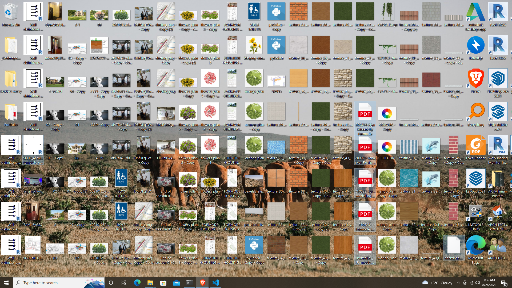
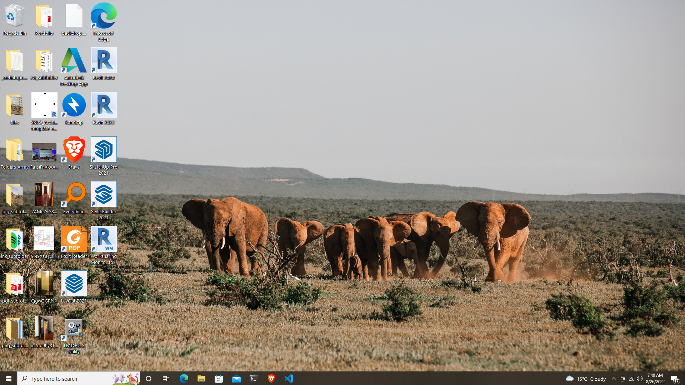

## Table of contents:
- [Introduction](#intro)
- [Technologies](#tech)
- [project Setup](#projo)
- [Illustrations](#illus)
- [Project Information](#info)
- [Contributing](#contri)
- [Acknowledgments](#know)

<INTRODUCTION>

<h1 id="intro">File Search</h1>

## brief
- Keep track of your desktop clutter


## Task:
    ```
    In the previous module of this course, you wrote a script that was able to move all your screenshots from your messy desktop into a new folder. In this project, you'll revisit your file mover code and expand on it with the knowledge of some additional data types, in order to make it more flexible and powerful.

    When you built your file mover, you used the pathlib module that worked with Path() objects. You can consider Path() objects as yet another data type, one that is more custom and not considered a built-in type. As you might remember, you'll have to import it from the standard library in order to work with it.

    In this project, you'll continue to work with pathlib and files, but you'll also use some of the additional built-in data types that you got to know in this section.

    File Type Counter
    Path() objects have an attribute called .suffix that allows you to get the file extension of each file that you're working with. You used it previously to decide which files are screenshots:

    if filepath.suffix == '.png':
    pass  # Do something
    Now, your desktop has gotten quite messy again, but this time you want to know what's on there and what keeps cluttering it up!

    To get that information, write a script that locates your Desktop, fetches all the files that are on there, and counts how many files of each different file type are on your desktop. Use a dictionary to collect this data, and print it to your console at the end in order to get an overview of what is there.

    Info: You can use another package from the standard library called pprint, which stands for "pretty print", in order to display your output nicely formatted.
    You can now expand on your file mover script and add logic that moves all file types that have e.g. more than five files on the desktop into their own separate folder. Will it help to keep your desktop cleaner?

    It could be interesting to keep track of what types of files keep agglomerating on your desktop in surprising numbers, also after you've cleaned it yet again. You wrote this script that counts them and shows you the counts as a dictionary, but you'll probably forget these numbers until the next time you run the script.

    You could copy the dictionary and save it in a text document. But that sounds repetitive and also like something you might be able to automate using Python. In the next section, you'll learn about File Input/Output so you can write data to files, and read it back from there.

    by codingnomads
    ```

<TECHNOLOGIES>

<h1 id="tech">Technologies</h1>

## Builth With
- Python


<PROJECT-SETUP>

<h1 id="projo">Project Setup</h1>


## Hardware Requirements
- You will need a desktop or a laptop computer
- RAM: A minimum of 4GB RAM is recommended
- Disk Space: You should have at least 5GB free of space on your working hard drive

## Software Requirements

## Prerequisites

To get this project up and running locally, you must already have python plus the necessary packages installed on your computer

**simple steps to set up on your local machine**

```
- $ git clone `$ git clone https://github.com/symonkipkemei/file-counter.git`
- $ git checkout develop
- Run `python file-counter.py`
```

- [Live Version](https://replit.com/@symonkipkemei/file-counter#file-counter.py)


<ILLUSTRATIONS>

<h1 id="illus">Illustrations</h1>





<PROJECT-INFORMATION>

<h1 id="info">Project Information</h1>

## Project Status
- In development

## Features
- A decoding option
- Allow user to paste long paragraphs
- An interface to allow the user to choose between encrypting and decrypting

## TODO


<CONTRIBUTING>

<h1 id="contri">🤝 Contributing</h1>

Contributions, issues and feature requests are always welcome!

I love meeting other developers, interacting and sharing.

Feel free to check the [issues page](https://github.com/symonkipkemei/file-counter/issues).

### How to Contribute

To get a local copy up and running follow these simple example steps.

```
- Fork the repository
- git clone https://github.com/your_username/file-counter
- git checkout develop
- git checkout -b branch name
- git remote add upstream https://github.com/symonkipkemei/file-counter
- git pull upstream develop
- git commit -m "commit message"
- git push -u origin HEAD
```


<ACKNOWLEDGMENTS>

<h1 id="know">Acknowledgements</h1>

## Author

👤 **Symon Kipkemei**

- Github: [symonkipkemei](https://github.com/symonkipkemei)
- Twitter: [@symon_kipkemei](https://twitter.com/symon_kipkemei)
- LinkedIn: [Symon kipkemei](https://www.linkedin.com/in/symon-kipkemei/)


## Show your support

Finally, if you've read this far, don't forget to give this repo a ⭐️. They're free . . . .

## Acknowledgments

- [codingnomads](https://codingnomads.co/).
